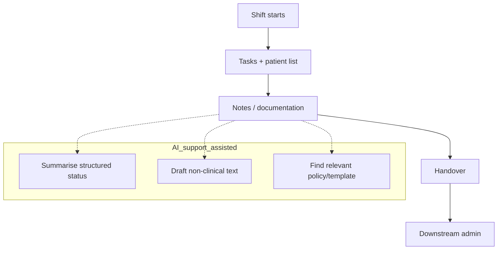

# Nursing documentation & admin burden — pilot taster

Audience: Director of Nursing / Quality & Patient Safety

Status: draft (shareable)

## Executive summary

Nursing time is the scarcest resource in a hospital.

This pilot proposes a 4–6 week, safety‑first AI deployment focused on reducing administrative friction without introducing unsafe clinical automation.

Default posture: start with templates, structured inputs, and admin support — not autonomous clinical advice.

## What we’ll do (4–6 weeks)

1. Map one documentation/admin workflow end-to-end (choose one ward/unit)
2. Identify where time is being lost (duplication, searching, handoffs)
3. Deploy a small AI-supported workflow (assisted mode)
4. Measure time saved, error reduction, and user adoption

## What data we need (default)

- Documentation templates and policies
- Non-sensitive workflow artefacts (forms, checklists)
- Optional: de-identified example notes for formatting only (if explicitly agreed)

## Deliverables

- Workflow map + pain-point analysis
- Guardrails (“what the tool can/can’t do”)
- Prototype (template assist / checklist assist / policy lookup)
- Evaluation plan + measured pilot results

## Success metrics (examples)

- Time saved per shift on admin/documentation
- Reduced duplication or missing fields
- Higher staff satisfaction / adoption
- Fewer rework loops in handover

## Safety & governance posture

- Not a clinical decision-maker
- Human-in-the-loop always
- Access controls + audit logs
- Clear boundaries + escalation paths

## Why this is a good first pilot

- Directly protects clinical capacity
- Low-risk when scoped correctly
- Builds trust in governance and evaluation
