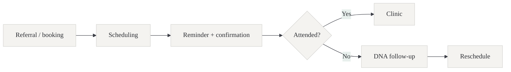
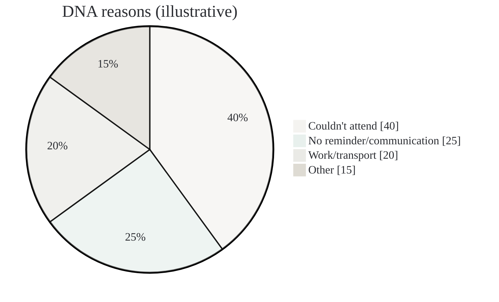

# Bon Secours Hospital Dublin — outpatients DNAs (pilot taster)

Audience: CEO / Ops / Outpatients management

Status: draft (shareable)

## Executive summary

DNAs waste clinical capacity, frustrate patients, and create avoidable admin load.

This pilot proposes a 4–6 week, safety‑first AI deployment focused on:

- identifying avoidable DNAs earlier,
- improving communications/worklists for staff,
- measuring impact with a clear go/no-go decision.

Default posture: start with scheduling and communication metadata, not patient notes.

## Why Bon Secours Dublin (context)

Bon Secours Hospital Dublin (Glasnevin) is a planned-care private hospital with a strong outpatient and diagnostics footprint. HIQA describes it as an elective adult-only acute general hospital with 90 inpatient beds and 70 day care beds. A DNA reduction pilot is a good fit because it can start from operational scheduling and communications data, deliver measurable gains within weeks, and stay inside clear safety boundaries.

## What we’ll do (4–6 weeks)

1. Map the appointment lifecycle (referral → scheduling → reminders → attendance)
2. Establish baseline DNA rate by clinic/service line and timing
3. Deploy a small AI-supported workflow (e.g., risk segmentation + worklists)
4. Run in shadow/assisted mode and measure outcomes

## What data we need (default)

- Appointment history (clinic, modality, slot type, lead time)
- Reminder events (SMS/email sent, confirmations)
- Attendance outcomes (attended, cancelled, DNA)
- Basic demographics only if approved and needed (minimised)

## Deliverables

- Baseline DNA analysis (where, when, and why it’s happening)
- A simple, usable intervention workflow (risk segmentation + staff worklists)
- Pilot results + recommendation for scaling

## Success metrics (examples)

- Reduction in DNA rate for targeted clinics
- Increased slot utilisation
- Reduced admin time chasing DNAs
- Faster time-to-next-available appointment

## Safety & governance posture

- No clinical advice; focuses on operational workflow
- Data minimisation by default
- Human decision-making retained
- Audit logs + access controls for any deployment

## Why this is a good first pilot

- Measurable within weeks
- Low technical risk
- High operational value and scalable across clinics
