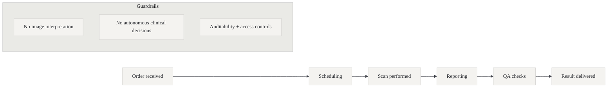
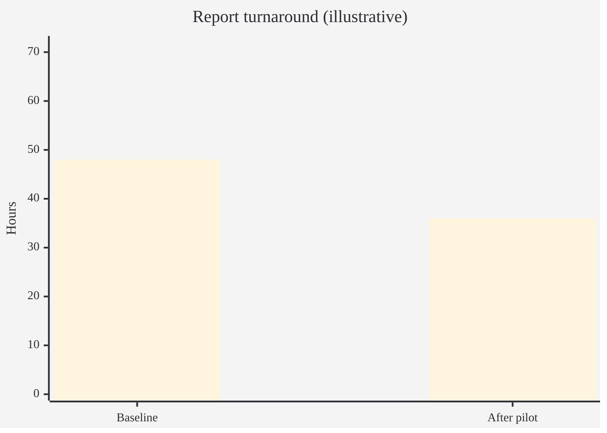

# Bon Secours Hospital Dublin — radiology operations & QA workflow (pilot taster)

Audience: Ops / Radiology leadership / CIO

Status: draft (shareable)

## Executive summary

Radiology is often a bottleneck: high volume, complex coordination, and heavy administrative overhead.

This pilot proposes a 4–6 week, safety‑first AI deployment focused on operations and quality processes, not diagnostic interpretation:

- prioritisation/worklist support based on operational signals
- “reason for delay” visibility
- report QA workflow support (format/completeness checks, not clinical correctness)

Default posture: no image interpretation and no autonomous clinical decisions.

## Why Bon Secours Dublin (context)

Bon Secours Hospital Dublin (Glasnevin) is a planned-care private hospital with a strong diagnostics footprint. HIQA describes it as an elective adult-only acute general hospital with 90 inpatient beds and 70 day care beds. That model makes radiology and diagnostic workflows a direct constraint on theatre efficiency, outpatient throughput, and patient experience.

## What we’ll do (4–6 weeks)

1. Map the end-to-end workflow (order → scheduling → scan → report → communication)
2. Identify a single high-friction point to target (e.g., scheduling, backlog management, QA)
3. Deploy a small AI-supported workflow (assisted mode)
4. Measure impact and agree next-step scaling

## What data we need (default)

- Operational RIS/PACS metadata (timestamps, modality, queue status)
- Worklist and backlog data (counts, age, routing)
- Non-identifying operational labels (e.g., “awaiting scheduling”, “awaiting report”)

Optional (only if agreed): de-identified report text for formatting/completeness QA.

## Deliverables

- Current-state map + bottleneck analysis
- A pilot workflow design (human-in-the-loop)
- Prototype (dashboard/worklist/QA support)
- Evaluation plan + measured pilot results

## Success metrics (examples)

- Reduced backlog age (p50/p90)
- Reduced handoff delays
- Reduced admin time per case
- Improved report completeness/standardisation (if QA wedge)

## Safety & governance posture

- Explicitly non-diagnostic scope
- Human-in-the-loop and clear escalation paths
- Data minimisation and least-privilege access
- Audit logs and monitoring

## Why this is a good first pilot

- High operational ROI potential
- Clear safety boundaries
- Builds reusable readiness/governance muscle for later clinical AI work
