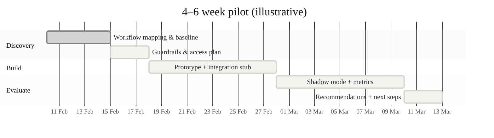
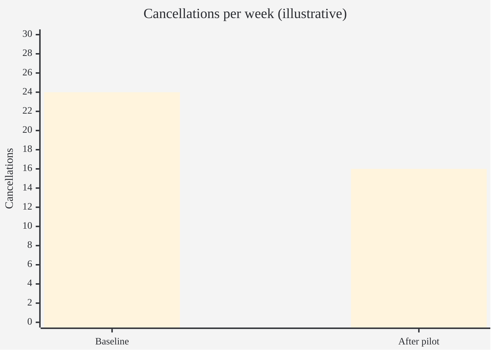

# Theatre utilisation & cancellations — pilot taster

Audience: CEO / Ops / Clinical leadership

Status: draft (shareable)

## Executive summary

Theatre time is expensive and constrained. A large share of cancellations are predictable *early enough* to intervene.

This pilot proposes a 4–6 week, safety‑first AI deployment focused on:

- earlier visibility into cancellation risk,
- structured reasons and bottlenecks,
- workflow changes that reduce avoidable cancellations.

Default posture: no patient notes; rely on operational metadata and scheduling signals.

## What we’ll do (4–6 weeks)

1. Map the workflow (booking → pre-op → day-of-surgery)
2. Identify the top cancellation drivers and where interventions are feasible
3. Implement a small AI-supported workflow (e.g., risk flagging + reason capture + escalation)
4. Run in shadow/assisted mode and measure outcomes

## What data we need (default)

- Theatre schedule (procedure type/category, session, specialty)
- Booking timestamps + changes
- Operational status changes (confirmed, pending, cancelled)
- Structured cancellation reasons (if available)
- Staffing / capacity constraints (coarse)

## Deliverables

- A short “current state” map + bottleneck analysis
- A prioritised intervention list (what changes *actually* reduce cancellations)
- A small prototype/workflow (UI and/or reporting) to support earlier interventions
- Evaluation plan + measured pilot results

## Success metrics (examples)

- Reduction in same-day cancellations
- Reduction in avoidable cancellations
- Increased theatre utilisation (or fewer overruns)
- Staff time saved in coordination/admin

## Safety & governance posture

- Not diagnostic decision support
- Human-in-the-loop: AI suggests/flags; staff decide
- Data minimisation by default
- Access controls + audit logs for any deployment
- Clear “do not use” boundaries (e.g., no clinical advice)

## Why this is a good first pilot

- Operationally meaningful and measurable
- Low risk (no notes by default)
- Generates reusable capability (data mapping, evaluation, governance) for later clinical projects
